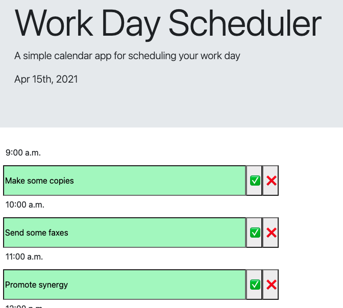

# Day Planner

<h1 align="center">
Day Planner
</h1>
    This project challenged me to build a day planner that stores events in local storage that are available until removed manually.
     
    <!-- TABLE OF CONTENTS -->

  
Table of Contents

  <ol>
    <li>
      <a href="#about-the-project">About The Project</a>
    </li>
    <li><a href="#acknowledgements">Acknowledgements</a></li>
  </ol>

<!-- ABOUT THE PROJECT -->
## About The Project

 
 This project was difficult in that it required me to stick to the scope of the requirements and not spend a lot of time building functionality that wasn't required. While I'm pretty pleased with how it turned out, I can't help but feel like I'm failing in regard to user interface.

<!-- ACKNOWLEDGEMENTS -->
## Acknowledgements
* Best readme template (https://github.com/othneildrew/Best-README-Template/find/master)

